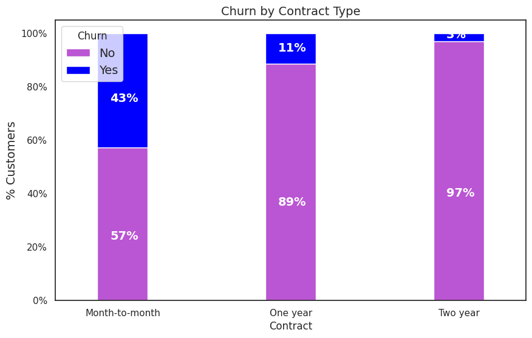
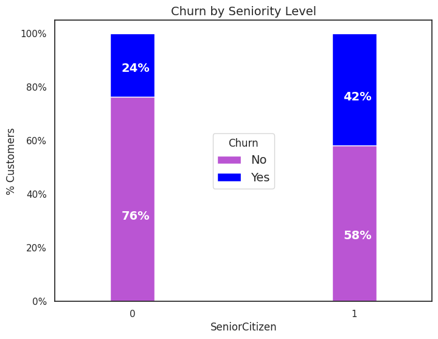
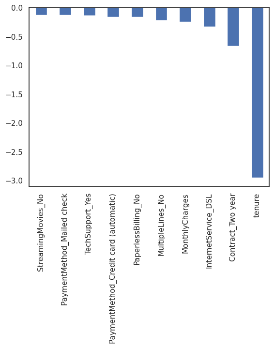

# SpeakX-assignment
Predicting Customer Churn in a Telecommunications Company

# Telecom Churn Prediction 

Telecom Churn Prediction is a process where we predict whether a customer will stop using a telecom service.

## 1. Data Collection

Data is in form given in Telco_Customer_Churn.csv file in the following format

<table border="1" class="dataframe">
  <thead>
    <tr style="text-align: right;">
      <th></th>
      <th>customerID</th>
      <th>gender</th>
      <th>SeniorCitizen</th>
      <th>Partner</th>
      <th>Dependents</th>
      <th>tenure</th>
      <th>PhoneService</th>
      <th>MultipleLines</th>
      <th>InternetService</th>
      <th>OnlineSecurity</th>
      <th>...</th>
      <th>DeviceProtection</th>
      <th>TechSupport</th>
      <th>StreamingTV</th>
      <th>StreamingMovies</th>
      <th>Contract</th>
      <th>PaperlessBilling</th>
      <th>PaymentMethod</th>
      <th>MonthlyCharges</th>
      <th>TotalCharges</th>
      <th>Churn</th>
    </tr>
  </thead>
  <tbody>
    <tr>
      <th>0</th>
      <td>7590-VHVEG</td>
      <td>Female</td>
      <td>0</td>
      <td>Yes</td>
      <td>No</td>
      <td>1</td>
      <td>No</td>
      <td>No phone service</td>
      <td>DSL</td>
      <td>No</td>
      <td>...</td>
      <td>No</td>
      <td>No</td>
      <td>No</td>
      <td>No</td>
      <td>Month-to-month</td>
      <td>Yes</td>
      <td>Electronic check</td>
      <td>29.85</td>
      <td>29.85</td>
      <td>No</td>
    </tr>
    <tr>
      <th>1</th>
      <td>5575-GNVDE</td>
      <td>Male</td>
      <td>0</td>
      <td>No</td>
      <td>No</td>
      <td>34</td>
      <td>Yes</td>
      <td>No</td>
      <td>DSL</td>
      <td>Yes</td>
      <td>...</td>
      <td>Yes</td>
      <td>No</td>
      <td>No</td>
      <td>No</td>
      <td>One year</td>
      <td>No</td>
      <td>Mailed check</td>
      <td>56.95</td>
      <td>1889.5</td>
      <td>No</td>
    </tr>
    <tr>
      <th>2</th>
      <td>3668-QPYBK</td>
      <td>Male</td>
      <td>0</td>
      <td>No</td>
      <td>No</td>
      <td>2</td>
      <td>Yes</td>
      <td>No</td>
      <td>DSL</td>
      <td>Yes</td>
      <td>...</td>
      <td>No</td>
      <td>No</td>
      <td>No</td>
      <td>No</td>
      <td>Month-to-month</td>
      <td>Yes</td>
      <td>Mailed check</td>
      <td>53.85</td>
      <td>108.15</td>
      <td>Yes</td>
    </tr>
    <tr>
      <th>3</th>
      <td>7795-CFOCW</td>
      <td>Male</td>
      <td>0</td>
      <td>No</td>
      <td>No</td>
      <td>45</td>
      <td>No</td>
      <td>No phone service</td>
      <td>DSL</td>
      <td>Yes</td>
      <td>...</td>
      <td>Yes</td>
      <td>Yes</td>
      <td>No</td>
      <td>No</td>
      <td>One year</td>
      <td>No</td>
      <td>Bank transfer (automatic)</td>
      <td>42.30</td>
      <td>1840.75</td>
      <td>No</td>
    </tr>
    <tr>
      <th>4</th>
      <td>9237-HQITU</td>
      <td>Female</td>
      <td>0</td>
      <td>No</td>
      <td>No</td>
      <td>2</td>
      <td>Yes</td>
      <td>No</td>
      <td>Fiber optic</td>
      <td>No</td>
      <td>...</td>
      <td>No</td>
      <td>No</td>
      <td>No</td>
      <td>No</td>
      <td>Month-to-month</td>
      <td>Yes</td>
      <td>Electronic check</td>
      <td>70.70</td>
      <td>151.65</td>
      <td>Yes</td>
    </tr>
  </tbody>
</table>

5 rows × 21 columns

## 2. Data Preprocessing

First we drop the customerID column.  
We handle missig values by removing them. 
 Values yes and no for "Churn" are converted into 1s and 0s.
The get_dummies function work takes a data frame, series, or list.
Then, it converts each unique element present in the object to a column heading.
The function iterates over the object that is passed and checks if the element at the particular index matches the column heading.
If it does, it encodes it as a 1.
Otherwise, it assigns it a 0.

<table border="1" class="dataframe">
  <thead>
    <tr style="text-align: right;">
      <th></th>
      <th>SeniorCitizen</th>
      <th>tenure</th>
      <th>MonthlyCharges</th>
      <th>TotalCharges</th>
      <th>Churn</th>
      <th>gender_Female</th>
      <th>gender_Male</th>
      <th>Partner_No</th>
      <th>Partner_Yes</th>
      <th>Dependents_No</th>
      <th>...</th>
      <th>StreamingMovies_Yes</th>
      <th>Contract_Month-to-month</th>
      <th>Contract_One year</th>
      <th>Contract_Two year</th>
      <th>PaperlessBilling_No</th>
      <th>PaperlessBilling_Yes</th>
      <th>PaymentMethod_Bank transfer (automatic)</th>
      <th>PaymentMethod_Credit card (automatic)</th>
      <th>PaymentMethod_Electronic check</th>
      <th>PaymentMethod_Mailed check</th>
    </tr>
  </thead>
  <tbody>
    <tr>
      <th>0</th>
      <td>0</td>
      <td>1</td>
      <td>29.85</td>
      <td>29.85</td>
      <td>0</td>
      <td>1</td>
      <td>0</td>
      <td>0</td>
      <td>1</td>
      <td>1</td>
      <td>...</td>
      <td>0</td>
      <td>1</td>
      <td>0</td>
      <td>0</td>
      <td>0</td>
      <td>1</td>
      <td>0</td>
      <td>0</td>
      <td>1</td>
      <td>0</td>
    </tr>
    <tr>
      <th>1</th>
      <td>0</td>
      <td>34</td>
      <td>56.95</td>
      <td>1889.50</td>
      <td>0</td>
      <td>0</td>
      <td>1</td>
      <td>1</td>
      <td>0</td>
      <td>1</td>
      <td>...</td>
      <td>0</td>
      <td>0</td>
      <td>1</td>
      <td>0</td>
      <td>1</td>
      <td>0</td>
      <td>0</td>
      <td>0</td>
      <td>0</td>
      <td>1</td>
    </tr>
    <tr>
      <th>2</th>
      <td>0</td>
      <td>2</td>
      <td>53.85</td>
      <td>108.15</td>
      <td>1</td>
      <td>0</td>
      <td>1</td>
      <td>1</td>
      <td>0</td>
      <td>1</td>
      <td>...</td>
      <td>0</td>
      <td>1</td>
      <td>0</td>
      <td>0</td>
      <td>0</td>
      <td>1</td>
      <td>0</td>
      <td>0</td>
      <td>0</td>
      <td>1</td>
    </tr>
    <tr>
      <th>3</th>
      <td>0</td>
      <td>45</td>
      <td>42.30</td>
      <td>1840.75</td>
      <td>0</td>
      <td>0</td>
      <td>1</td>
      <td>1</td>
      <td>0</td>
      <td>1</td>
      <td>...</td>
      <td>0</td>
      <td>0</td>
      <td>1</td>
      <td>0</td>
      <td>1</td>
      <td>0</td>
      <td>1</td>
      <td>0</td>
      <td>0</td>
      <td>0</td>
    </tr>
    <tr>
      <th>4</th>
      <td>0</td>
      <td>2</td>
      <td>70.70</td>
      <td>151.65</td>
      <td>1</td>
      <td>1</td>
      <td>0</td>
      <td>1</td>
      <td>0</td>
      <td>1</td>
      <td>...</td>
      <td>0</td>
      <td>1</td>
      <td>0</td>
      <td>0</td>
      <td>0</td>
      <td>1</td>
      <td>0</td>
      <td>0</td>
      <td>1</td>
      <td>0</td>
    </tr>
  </tbody>
</table>

5 rows × 46 columns

## 3. Exploratory Data Analysis (EDA)

EDA is performed to understand the data, find patterns, and identify important features that will contribute to the prediction of customer churn.
### Correlation of "Churn" with other variables

Churn appears to be positively connected with month-to-month contracts, the lack of online security, and tech support. Two-year contracts appear to have a negative correlation with turnover, despite tenure.

It is noteworthy that churn appears to be adversely affected by services like online security, tech assistance, online backup, streaming TV, and online backup that do not require an internet connection.

### Analyzing age range, patner and dependent status of the customers
16.2% customers are senior citizens. 83.8% are young. 

Customers with dependent and partners 

### Analyzing customer information tenure / contract / services etc.

**Tenure** - A lot of customers have been with the telecom company for just a month,as well as many have a tenure period of 72 months. This denotes different customers have different contracts. Based on the contract they are into it could be more/less easier for the customers to stay/leave the telecom company. For example , people with less tenure might have less likelyhood of staying while the oppsoite is true for people with longer tenure. 

**Contract Type** - looking at customers with different contracts
most of the customers are in the month to month contract. While there are equal number of customers in the 1 year and 2 year contracts. 

**Relatinship between contract type and tenure period** - Most of the monthly contracts last for 1-2 months, while the 2 year contracts tend to last for about 70 months. This shows that the customers taking a longer contract are more loyal to the company and tend to stay with it for a longer period of time.
This is also what we saw in the earlier chart on correlation with the churn rate. 

**services used by customers** -  Let us now look at the distribution of various services used by customers 

## Relationship between predictor variable (Churn) and its interaction with other important variables as was found out in the correlation plot.

**Churn vs Tenure** - As we can see form the below plot, the customers who do not churn, they tend to stay for a longer tenure with the telecom company. 

**Churn vs Contract type** - Similar to what we saw in the correlation plot, the customers who have a month to month contract have a very high churn rate. 

**Churn vs Seniority** - Senior Citizens have hgher churn rates than young people 

**Churn vs Monthly Charges** - Higher % of customers churn when the monthly charges are high. 

## 4. Model Building

Several machine learning algorithms can be used to build the model. These include Logistic Regression, Decision Trees, Random Forest, Gradient Boosting, and Neural Networks. The model that performs the best is selected.

**Logistic Regression** -
Logistic Regression is a statistical model that uses a logistic function to model a binary dependent variable. In simple terms, it predicts the probability of occurrence of an event by fitting data to a logit function. Hence, it is also known as logit regression. Since it predicts the probability, its output values lie between 0 and 1 (as expected). It is a special case of linear regression where the target variable is categorical in nature. It uses the concept of odds ratios to provide estimates of the probability of occurrence of the events.

We are using the target variable "Churn" as Y and the rest of the columns as X. 
By taking all the features into account we get an accuracy of about 80%. 

As we can see, certain variables are positively correlated with our projected variable, churn, while others are negatively correlated. A negative relationship indicates that the variable's likelihood of causing churn lowers.

We saw in our EDA that a two-month contract lowers the likelihood of churn. According to logistic regressions, the two-month contract and tenure have the strongest negative relationships with turnover.
Additionally, having DSL internet service lessens the likelihood of churn.
Finally, larger churn rates may result from total charges, monthly contracts, fibre optic internet services, and seniority. This is intriguing as, despite fibre optic services' speed advantages, they are likely to induce client attrition.

 

**ADAboost** - AdaBoost, short for Adaptive Boosting, is a machine learning algorithm that is used as an ensemble method to improve the performance of other learning algorithms. It works by fitting a sequence of weak learners (models that are only slightly better than random guessing, such as small decision trees) on repeatedly modified versions of the data. The predictions from all of them are then combined through a weighted majority vote (or sum) to produce the final prediction. The data modifications at each so-called boosting iteration consist of applying weights to each of the training samples. Initially, those weights are all set to 1/N, so the first step simply trains a weak learner on the original data. For each successive iteration, the sample weights are individually modified and the learning algorithm is reapplied to the reweighted data. At a given step, those training examples that were incorrectly predicted by the boosted model induced at the previous step have their weights increased, whereas the weights are decreased for those that were predicted correctly. As iterations proceed, examples that are difficult to predict receive ever-increasing influence. Each subsequent weak learner is thereby forced to concentrate on the examples that are missed by the previous ones in the sequence.

We get an accuracy of 79% with ADAboost.

**Random Forest** - Random Forest is a versatile machine learning method capable of performing both regression and classification tasks. It is a type of ensemble learning method, where a group of weak models combine to form a powerful model. In Random Forest, we grow multiple trees as opposed to a single tree in CART model (Classification and Regression Tree). To classify a new object based on attributes, each tree gives a classification. The forest chooses the classification having the most votes (over all the trees in the forest) and in case of regression, it takes the average of outputs by different trees.

From random forest algorithm, monthly contract, tenure and total charges are the most important predictor variables to predict churn.
The results from random forest are very similar to that of the logistic regression and in line to what we had expected from our EDA

## 5. Model Evaluation

The models are evaluated using K-cross validation .K set to 5, your data is split into 5 equal parts, or "folds". For each iteration of the cross-validation, 4 of these folds are used for training the model and 1 fold is used for testing the model. 
Logistic Regression: 0.8028995441407067 
AdaBoost: 0.807166362861571 
Random Forest: 0.8016182044461699 
XGBoost: 0.7804306045468654 
